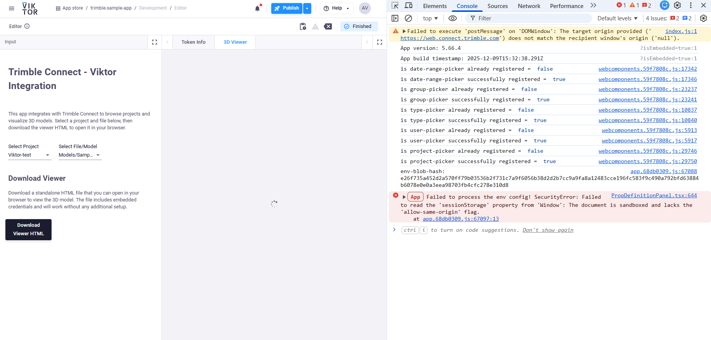

## Trimble Viewer - Viktor Issues

VIKTOR’s WebView runs inside a sandboxed iframe without allow-same-origin, and Trimble’s web app tries to use sessionStorage during startup. In a sandbox without allow-same-origin, the browser treats the iframe as an “opaque origin,” so Web Storage (and some other APIs) are blocked, and Trimble crashes exactly where it calls window.sessionStorage

Trimble also documents that the 3D Viewer is meant to be embedded in an iframe via the Workspace API. 
https://components.connect.trimble.com/trimble-connect-workspace-api/index.html

## Links

VIKTOR community (WebView does NOT allow allow-same-origin):
https://community.viktor.ai/t/sesssionstorage-or-cookies-not-working-in-html-view/1728

Trimble Workspace API: embed the 3D Viewer using an iframe:
https://components.connect.trimble.com/trimble-connect-workspace-api/index.html

Trimble Workspace API docs (official developer site):
https://developer.trimble.com/docs/connect/tools/api/workspace

Browser spec explanation: sandbox WITHOUT allow-same-origin blocks storage/cookies (MDN CSP sandbox):
https://developer.mozilla.org/en-US/docs/Web/HTTP/Reference/Headers/Content-Security-Policy/sandbox

Sandboxed iframe flags explained (web.dev, includes allow-same-origin behavior):
https://web.dev/articles/sandboxed-iframes
